# eggtagram
<br>
인스타클론 코딩으로 만든 개인 프로젝트입니다. <br>

## 배포는 
[여기서](http://eggman9298.cafe24.com/)   (~2021.08.19)
------------------  

## 주요 기술
- 로그인 / 회원가입(중복 체크)
- 글 작성 (사진 미리보기)
- 댓글 작성/ 삭제(삭제는 작성자만)
- 좋아요 기능(실시간으로 카운팅)
- 팔로우 추가 삭제
- 사용자 검색(자동완성)

## 기술
- spring
- Jquery
- MariaDB
- Bootstrap 4

## 프로젝트 구조

```bash
├─src
│  ├─main
│  │  ├─java
│  │  │  └─com
│  │  │      └─eggta
│  │  │          ├─ctrl
│  │  │          │      ArticleController.java
│  │  │          │      CommentController.java
│  │  │          │      FollowController.java
│  │  │          │      HomeController.java
│  │  │          │      LikeController.java
│  │  │          │      UserController.java
│  │  │          │
│  │  │          ├─domain
│  │  │          │      ArticleVO.java
│  │  │          │      CommentVO.java
│  │  │          │      FileVO.java
│  │  │          │      FollowVO.java
│  │  │          │      LikeVO.java
│  │  │          │      UserVO.java
│  │  │          │
│  │  │          ├─orm
│  │  │          │      AuthLoginInterceptor.java
│  │  │          │      FileProcessor.java
│  │  │          │      FileSweeper.java
│  │  │          │
│  │  │          ├─persistence
│  │  │          │      ArticleDAO.java
│  │  │          │      ArticleDAOimp.java
│  │  │          │      CommentDAO.java
│  │  │          │      CommentDAOimp.java
│  │  │          │      FileDAO.java
│  │  │          │      FileDAOimp.java
│  │  │          │      FollowDAO.java
│  │  │          │      FollowDAOimp.java
│  │  │          │      LikeDAO.java
│  │  │          │      LikeDAOimp.java
│  │  │          │      UserDAO.java
│  │  │          │      UserDAOimp.java
│  │  │          │
│  │  │          └─service
│  │  │                  ArticleService.java
│  │  │                  ArticleServiceimp.java
│  │  │                  CommentService.java
│  │  │                  CommentServiceimp.java
│  │  │                  FileService.java
│  │  │                  FileServiceimp.java
│  │  │                  FollowService.java
│  │  │                  FolowServiceimp.java
│  │  │                  LikeService.java
│  │  │                  LikeServiceimp.java
│  │  │                  UserService.java
│  │  │                  UserServiceimp.java
│  │  │
│  │  ├─resources
│  │  │  │  log4j2.xml
│  │  │  │  log4jdbc.log4j2.properties
│  │  │  │  MybatisConfig.xml
│  │  │  │
│  │  │  ├─mappers
│  │  │  │      articleMapper.xml
│  │  │  │      commentMapper.xml
│  │  │  │      fileMapper.xml
│  │  │  │      followMapper.xml
│  │  │  │      likeMapper.xml
│  │  │  │      userMapper.xml
│  │  │  │
│  │  │  └─META-INF
│  │  └─webapp
│  │      ├─resources >>> bootstrap ,css 등 생략

│  │      └─WEB-INF
│  │          │  web.xml
│  │          │
│  │          ├─classes
│  │          ├─spring
│  │          │  │  root-context.xml
│  │          │  │  security-context.xml
│  │          │  │
│  │          │  └─appServlet
│  │          │          servlet-context.xml
│  │          │
│  │          ├─views
│  │          │  │  home.jsp
│  │          │  │
│  │          │  ├─article
│  │          │  │      detail.jsp
│  │          │  │      register.jsp
│  │          │  │
│  │          │  ├─common
│  │          │  │      10_header.jsp
│  │          │  │      20_nav.jsp
│  │          │  │      80_editnav.jsp
│  │          │  │      90_footer.jsp
│  │          │  │
│  │          │  ├─error
│  │          │  │      404.jsp
│  │          │  │
│  │          │  └─user
│  │          │          edit.jsp
│  │          │          error.jsp
│  │          │          login.jsp
│  │          │          profile.jsp
│  │          │          resign.jsp
│  │          │          signup.jsp
│  │          │          source.jsp
│  │          │
│  │          └─_init
│  │                  sql
│  │
│  └─test
│      ├─java
│      │  └─com
│      │      └─eggta
│      │          └─ctrl
│      └─resources
│              log4j.xml
│              log4jdbc.log4j2.properties
│              MybatisConfig.xml
│
└─target

                └─ctrl
```


## ERD 테이블
------
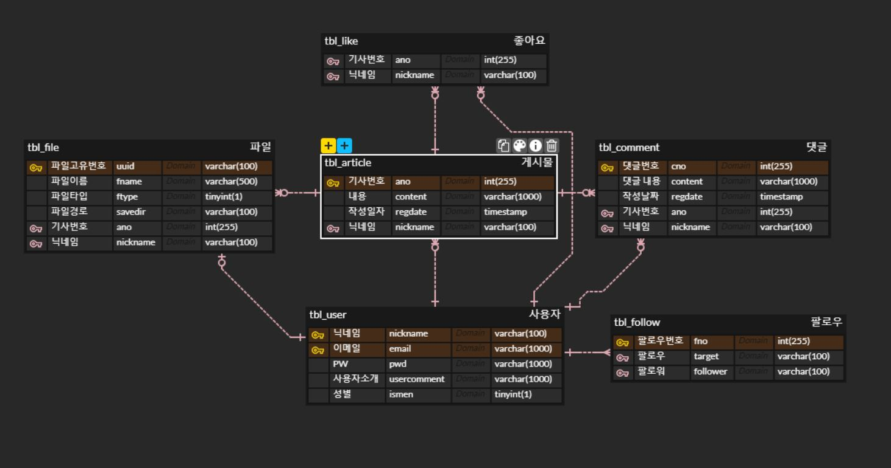


## 화면명세
------

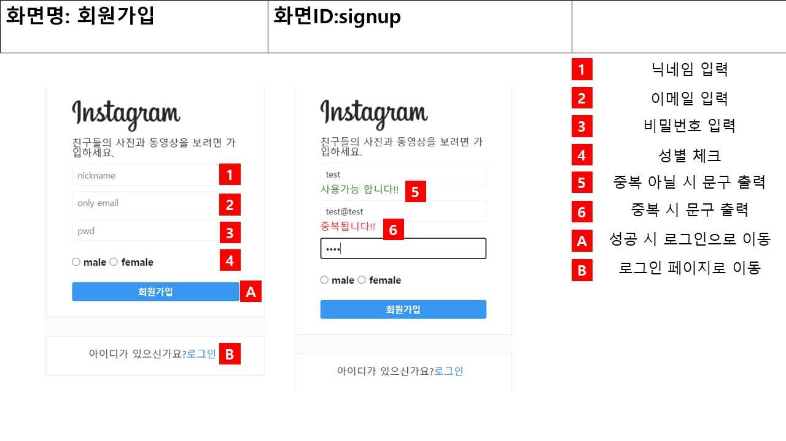
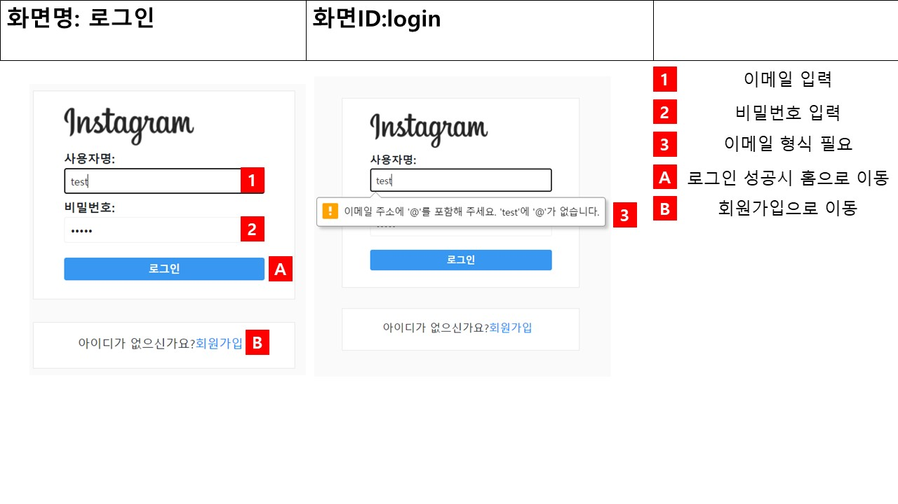
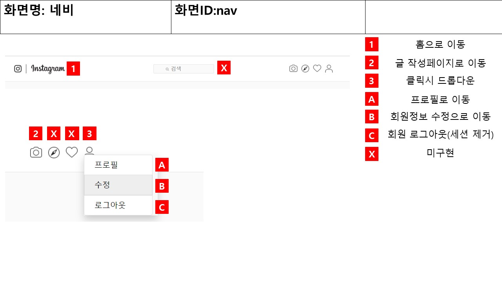
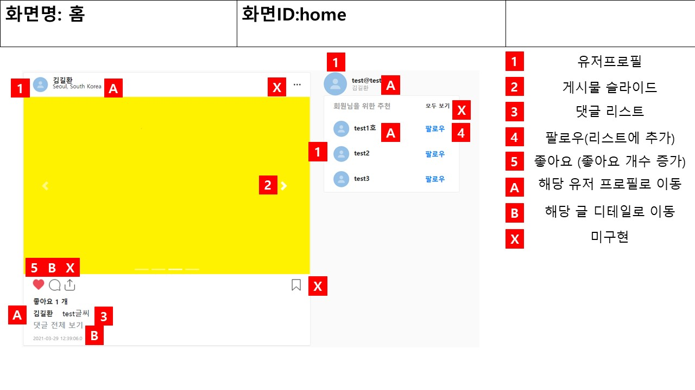
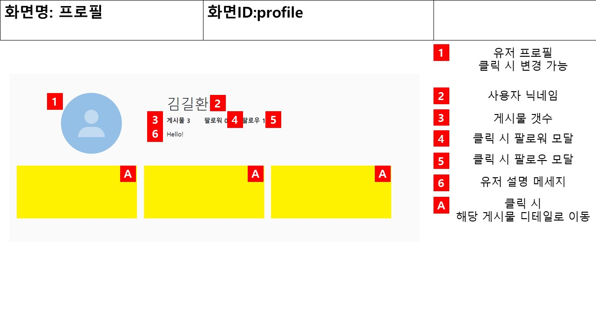
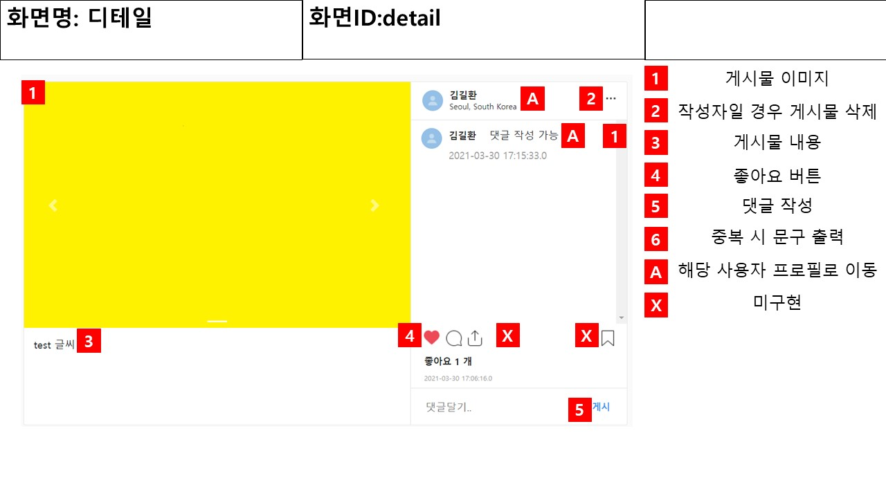
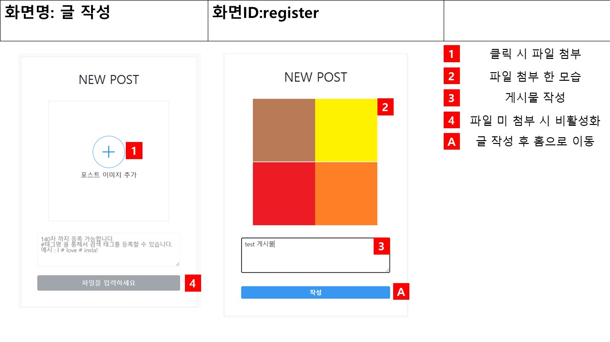
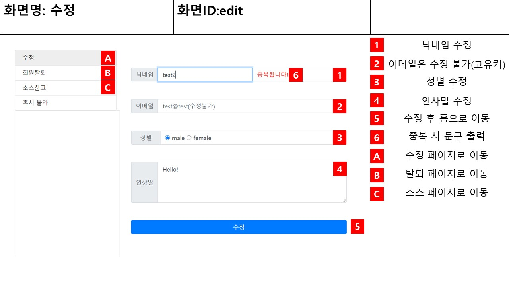
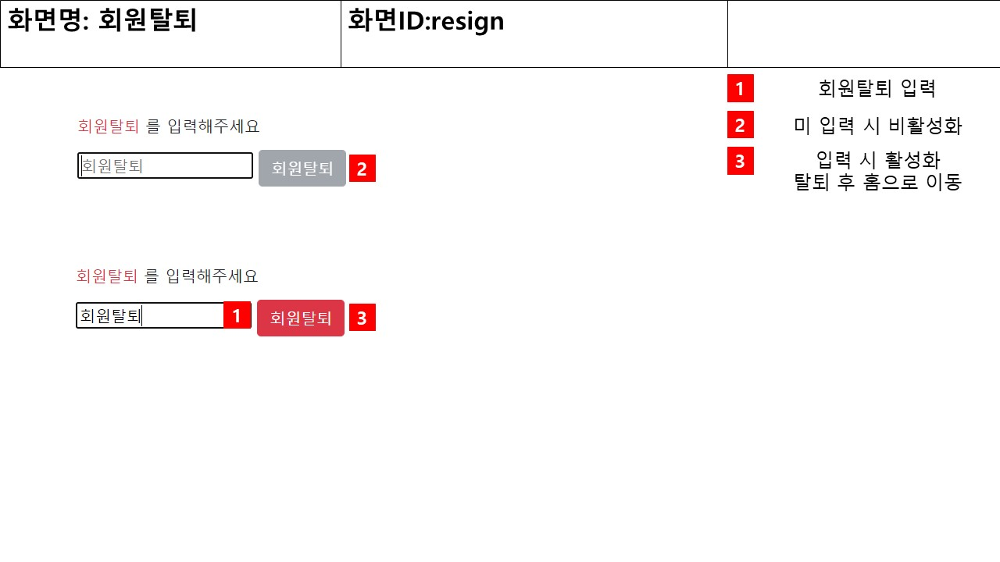
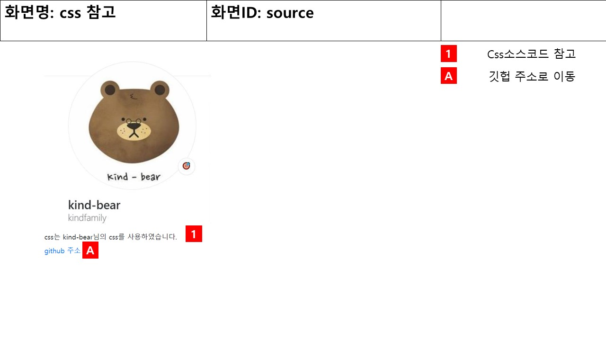


## TODO
- 반응형
- 무한스크롤
